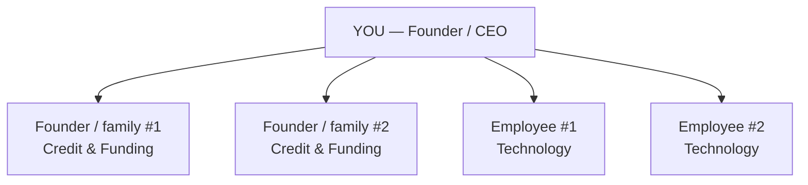
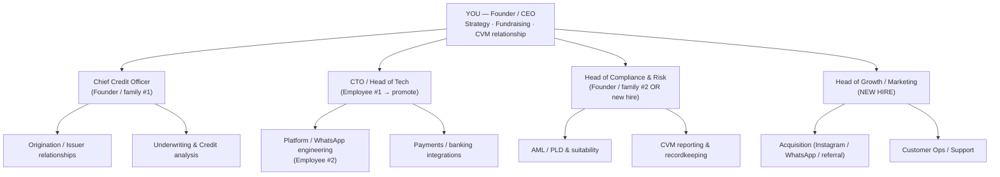

# XO Digital — Team & Org

## Current reality (corrected)
- **You** — Founder, at the top.
- **2 credit/funding members** — founders / founder's family. Currently run the credit
  and origination side.
- **2 technology members** — pure employees (not founders). Built and run the WhatsApp
  platform and banking integrations.

So today: 3 founders/family (you + 2 on credit) and 2 tech employees = 5 people total.

## Current org (as-is)

Gap: no one owns **Compliance/Risk**, **Growth/Marketing**, or **Operations/Support** —
all currently absorbed informally by you or left uncovered.

## Recommended target org (next 6–12 months)

## Key roles — who, and should it be a founder?

| Role | Recommended owner | Founder? | Reasoning |
|---|---|---|---|
| **CEO** | You | ✅ Founder | Strategy, capital, regulator relationship, culture. |
| **Chief Credit Officer** | Founder/family #1 | ✅ Founder | Credit quality *is* the product's trust. Keep it with an owner who has skin in the game. Good founder fit. |
| **Head of Compliance & Risk** | Founder/family #2 **only if** they can own CVM 88 full-time; **else external hire** | ⚠️ Prefer founder, but competence > title | Regulated obligation with personal/company liability. Must be full-time and expert. If #2 isn't a compliance specialist, hire one and give #2 a different owned area. |
| **CTO / Head of Tech** | Promote Employee #1 | ❌ Employee (give equity) | They built the platform. Formalize the title and grant **meaningful equity/options** to retain — key-person risk otherwise. |
| **Platform Engineer** | Employee #2 | ❌ Employee (give equity) | Same retention logic. |
| **Head of Growth / Marketing** | New hire | ❌ Hire | The missing engine for the "millions of customers" goal. Owns Instagram, WhatsApp funnels, referral. First priority external hire. |
| **Customer Ops / Support** | New hire (later) | ❌ Hire | Semi-automated WhatsApp support; trust with first cohorts. |

## The two decisions that unlock everything
1. **Compliance ownership:** Can Founder/family #2 own CVM 88 *full-time and competently*?
   - **Yes** → they become Head of Compliance & Risk. Cleanest.
   - **No** → hire a compliance specialist now; reassign #2 to another owned function
     (e.g. Operations, or deepen Credit).
2. **Retaining the two tech employees:** they built your core asset and are not founders.
   **Grant equity/options** and formal titles (CTO + Lead Engineer) to lock in the
   key-person risk before you scale and they become even harder to replace.

## Founding story (updated — now much stronger)
You are no longer "pre-launch." Lead with proof:
- Founded → **fully CVM 88-authorized in ~6 months**.
- **Live, working WhatsApp-native platform** — full journey inside WhatsApp.
- **Banking fully integrated and tested.**
- **Real products already issued and round-tripped** — invested, and received principal
  + interest back on schedule (1–2 week notes). The model *works*, with real money.
Use this in every hire and investor conversation. "It already works" beats any pitch deck.
